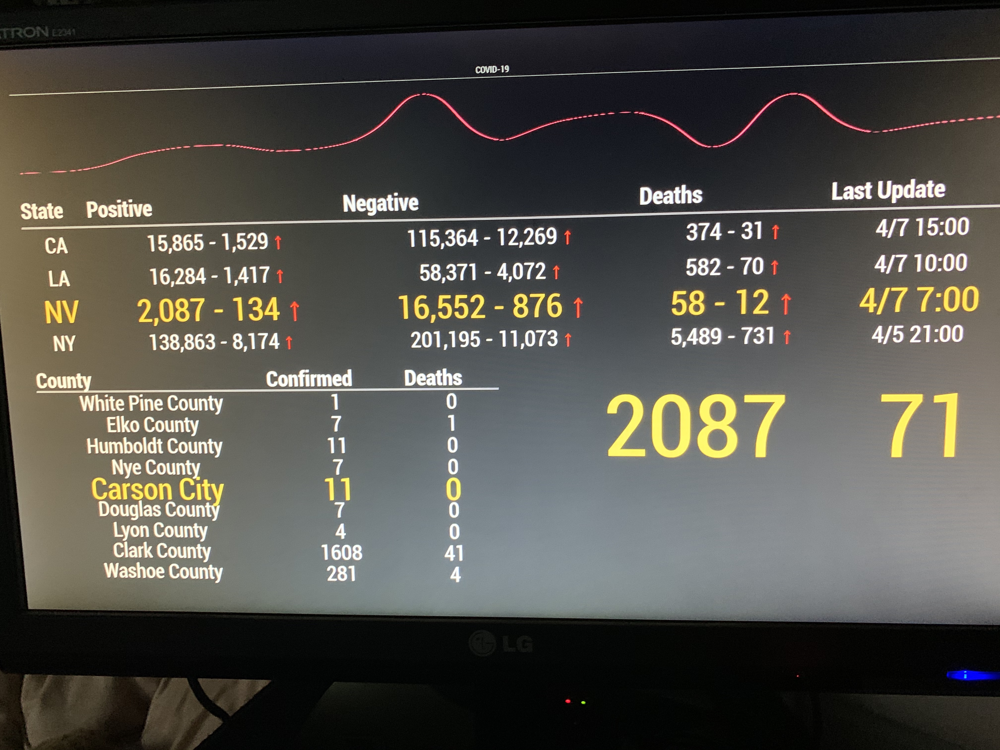

This is a work in progress.  There is a lot of dead code from API's that didn't work or were out dated. 

Steps to run on raspberry pi:
[Script to auto install](https://github.com/sdetweil/MagicMirror_scripts)

#### Example:
_Add to config/config.js

```
{
        module: "MMM-nvcovid",
        position: "top_bar"
},

```


